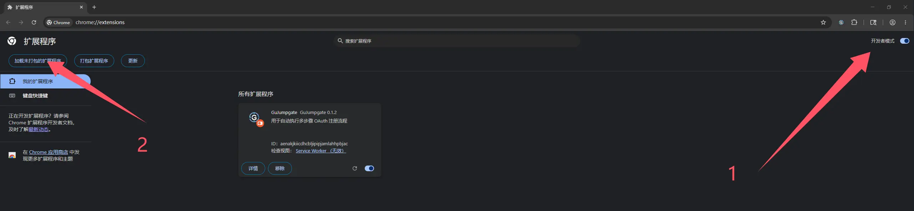
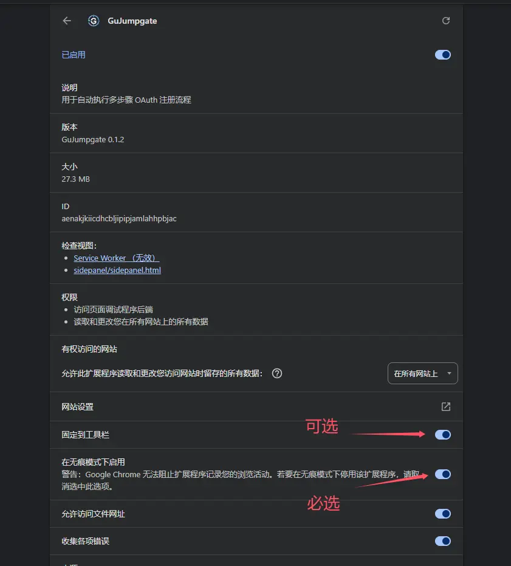
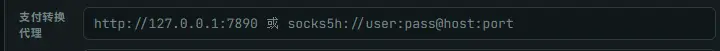
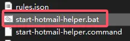
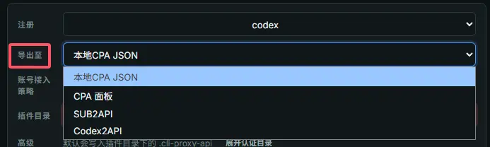
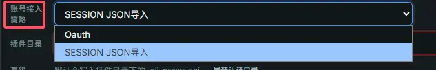
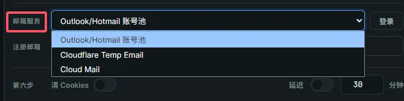

# GuJumpgate

一个也许能“真正解放双手”的全自动 GPT Plus 注册浏览器扩展。

如果这个项目能帮上你，欢迎点个 Star⭐~

> [!IMPORTANT]
> 目前 OAuth 风控严重，基本必跳手机绑定，所以只推荐走生成无 RT 的 JSON。
>
> 在扩展内的账号接入策略中，请务必选择：`导出至 - SESSION JSON 导入`。

## 已实现能力

1. **自动注册 Free 账号**

   借助 FlowPilot 项目实现 Free 账号的自动注册。

2. **PayPal 激活 Plus 全流程**

   - 自动跳转 Stripe 长链接
   - 自动填写 Stripe 账单并跳转 PayPal
   - 自动填写 PayPal 账单并完成流程

3. **Hotmail / Outlook 自动别名功能**

4. **PayPal 号码池管理**

5. **自动 OAuth 回调到本地及各面板**

   对 FlowPilot 原有回调流程做了调整和适配。

6. **支持跳过 OAuth**

   忽略 RT，生成只有 AT 的 JSON 文件到本地。

## 前提要求

1. 1 个带 API、且能连续正常接收 PayPal 验证码的 US `+1` 接码手机号
2. 1 个或 N 个支持 `IMAP` 和 `Graph` 的 Outlook 邮箱，或者自建 Cloudflare Temp Email / Cloud Mail
3. 1 个相对干净、支持 PayPal 注册的 US 代理

> [!NOTE]
> 自建 Cloudflare Temp Email / Cloud Mail 需要使用 `edu` 前缀，例如 `edu.openai.com`，才有试用资格。
>
> PayPal 注册代理越干净，越不容易触发 PayPal 注册滑块。账单页面的 Captcha 扩展已经实现了自动屏蔽。

## 测试环境

- 成功率：连续 10 次串行运行，注册并激活 Plus 100% 成功率
- 浏览器：Chrome `148.0.7778.168`（64 位正式版），开启无痕模式
- 网络环境： US 自建代理 + 云端转换

过程中遇到任何卡死的问题，都可以先停止，然后点击流程的各个节点进行重试，也可以点击旁边选择跳过。

## 安装与使用

先到本仓库的 [Releases](https://github.com/FoundZiGu/GuJumpgate/releases) 页面下载扩展压缩包并解压。

### 1. 打开扩展开发者模式

打开 `chrome://extensions/`，开启开发者模式。

### 2. 加载扩展目录

选择“加载已解压的扩展程序”，然后选择刚才解压出的文件夹。

### 3. 启用无痕权限

在扩展详情页中勾选“在无痕模式下启用”。

### 4. 配置代理

现在推荐且能走的路径是 **US注册** + **JP拿长链接** + **US付款**
这条路径还是可以稳定出试用和正常激活PLUS的

#### 方案一：使用云端转换 （推荐）

直接开启代理工具的规则/全局 US代理，选择云端转换，即可开始使用

#### 方案二：本地配置代理

配置本地用于支付转换的代理，出口必须是 JP 代理。

然后代理工具开启全局 US，或者配置好相应规则分流至 US。

### 5. 启动 Hotmail Helper

请注意：本地 JSON 生成导出依赖本地助手。无论你是否使用 Hotmail / Outlook 邮箱，都请启动。

运行解压目录内的脚本：

- Windows：`start-hotmail-helper.bat`
- macOS：`start-hotmail-helper.command`

### 6. 配置扩展参数

在扩展中打开侧边栏，按你的环境配置参数。

#### 选择最终 JSON 导出到的平台

账号接入策略建议选择：`导出至 - SESSION JSON 导入`。

> [!WARNING]
> OAuth 目前严重风控，要求绑定手机号，仅推荐使用 `导出至 - SESSION JSON 导入`。

#### JSON 类型说明

- `OAuth`：导出的 JSON 有刷新令牌，反代工具能持续使用
- `SESSION`：导出的 JSON 无刷新令牌，仅支持部分反代工具使用，例如 CPA / SUB2API；导出有效期大约 10 天，过期后需要重新获取

#### 验证码接口

填写可直接 `GET` 请求的 `http` / `https` 地址。

#### PAYPAL 接码电话

填写 PayPal 接码电话，注意按扩展提示填写格式。

#### 邮箱渠道

选择对应的邮箱渠道。自建邮箱需使用 `edu` 前缀获得试用资格。

然后填写或导入各自邮箱渠道所需的配置。

### 7. 开始运行

保存配置后即可开始运行。

## 版权与来源说明

本项目基于开源项目 [QLHazyCoder/FlowPilot](https://github.com/QLHazyCoder/FlowPilot) 进行修改、移植与二次开发，其部分早期代码与 [whwh1233/StepFlow-Duck](https://github.com/whwh1233/StepFlow-Duck) 具有共同历史。

原项目及其相关开源部分采用 MIT License 发布。根据 MIT License，你可以在保留原版权声明和许可声明的前提下使用、修改、分发本项目的相关代码。

为避免歧义，原项目作者、历史贡献者与当前二开版本之间不存在默认的认可、担保或背书关系。本项目中新增的适配、流程调整、脚本移植与文档整理内容，除另有说明外，均由当前维护者负责。

如果你分发本项目或其修改版本，请一并保留仓库中的 `LICENSE` 及相关来源说明文件。

## 使用提示

- 使用者应自行遵守目标平台服务条款、适用法律及其所在地区的监管要求

## 友情链接

- [LINUX DO - 新的理想型社区](https://linux.do/)
